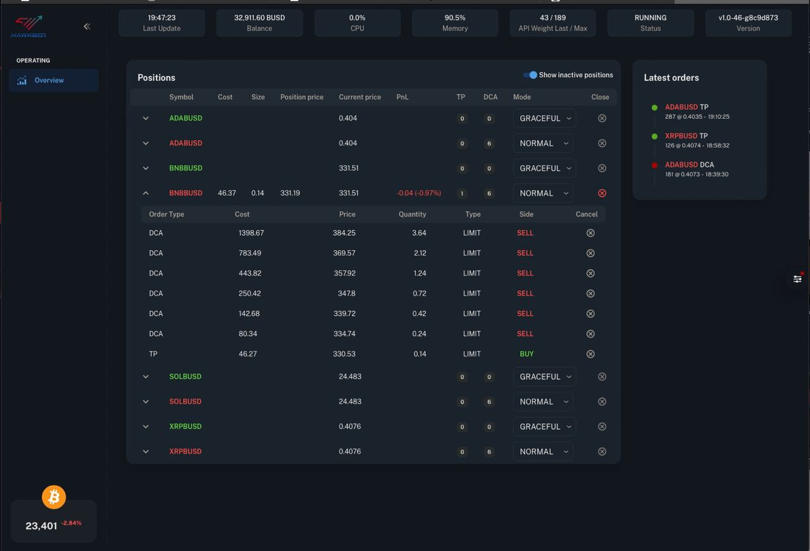

Hawkbot provides a web-based UI by default. This UI is disabled by default,
but can be enabled with a single argument to the commandline.

Due to the flexible plugin mechanism Hawkbot provides, it is also possible to write your own plugin to provide a custom UI.

The easiest way to enable the UI is by passing the `-W` argument to the commandline when starting the bot:

```python trade.py -W```

### Web UI

The web UI provides a web-based interface to monitor & interact with the bot. This UI is easier on the eyes, takes
litte server resources, and provides greater flexibility in functionality that can be implemented.
The web UI looks as follows:



For security reasons, it is advised to access the web UI over an SSH tunnel. If not using an SSH tunnel, make
sure you take appropriate security measures to keep access safe.

To use an SSH tunnel on Linux for example, you can use the following command:

`` ssh -L 6969:127.0.0.1:6969 <user>@<ip> ``

By default, the web UI can be reached on port 6969. If you want to use a different port, you can provide the following snippet in the config-file:

```json
"plugin_configs": {
    "RestServer": {
      "port": 9996
    }
  }
```